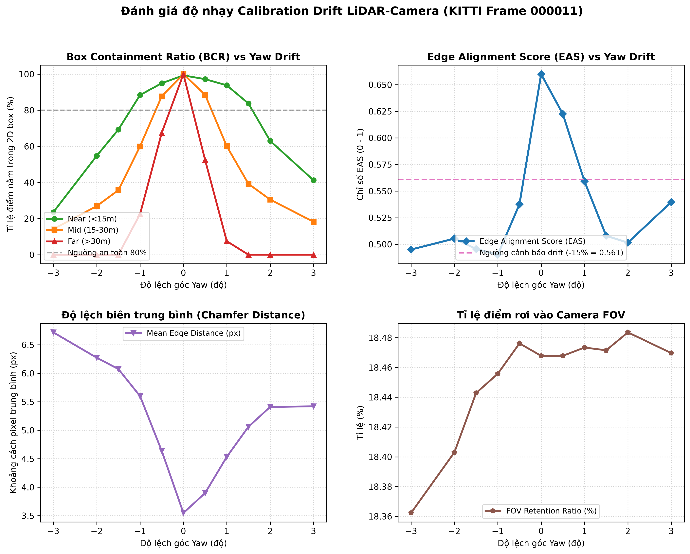
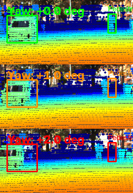
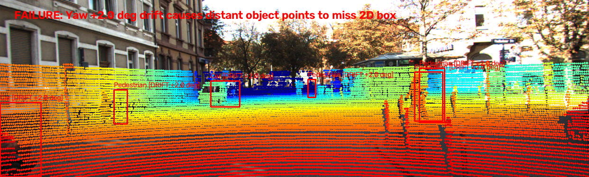

# Báo cáo Day 6: Kiểm tra Calibration LiDAR-Camera bằng Projection và Alignment Score

- **Họ tên:** Nguyễn Thế Khang
- **MSSV:** 2A202602964
- **Lớp:** K4-Track4
- **Link repo:** https://github.com/khangnguyenthe18/K4-Track4-Day06-NguyenTheKhang-2A202602964-3D-From-Point-Clouds
- **Topic:** A — Kiểm tra calibration LiDAR-camera bằng projection (LiDAR-camera projection QA)
- **Dataset:** data/synthetic, data/kitti_mini, data/nuscenes_mini_subset
- **Các frame đã dùng:** KITTI: 000011, 000021, 000049, 000004, 000025; nuScenes: scene-0103_010, scene-1094_010; Synthetic: 000000, 000003

## 1. Claim

Độ lệch góc yaw cảm biến LiDAR-camera từ 1.0° trở lên khiến hơn 20% điểm LiDAR thuộc vật thể rơi ra ngoài 2D bounding box ở cự ly > 25 m (đặc biệt rơi tự do về 7.5% ở cự ly 34 m) và làm giảm chỉ số Edge-Alignment Score (EAS) trên 15% (từ 0.660 xuống 0.559), cho phép thiết kế cơ chế tự động phát hiện calibration drift trực tuyến mà không cần nhãn 3D ground-truth.

## 2. Evidence

Thí nghiệm sweep góc lệch Yaw (-3.0° đến +3.0°) và tịnh tiến Translation X (±0.10m) trên KITTI frame 000011 (file `results/yaw_perturb_sweep.csv`):

| Cấu hình / mức perturb | BCR Overall (%) | BCR Far (>30m) (%) | EAS Score (0-1) | Mean Edge Dist (px) | Ghi chú |
|---|---|---|---|---|---|
| Yaw -2.0 deg | 36.3% | 0.0% | 0.5054 | 6.27 px | Lệch nặng, mất dấu vật xa |
| Yaw -1.0 deg | 68.0% | 22.5% | 0.4902 | 5.60 px | Vượt ngưỡng cảnh báo drift |
| Yaw -0.5 deg | 88.0% | 67.5% | 0.5377 | 4.64 px | Bắt đầu suy giảm ở cự ly xa |
| **Yaw 0.0 deg (Chuẩn)** | **99.7%** | **100.0%** | **0.6600** | **3.55 px** | **Calibration chuẩn, khớp viền** |
| Yaw +0.5 deg | 86.9% | 52.5% | 0.6225 | 3.90 px | Điểm bắt đầu tràn ra rìa box |
| Yaw +1.0 deg | 68.2% | 7.5% | 0.5592 | 4.53 px | EAS giảm 15.3%, kích hoạt báo động |
| Yaw +2.0 deg | 41.7% | 0.0% | 0.5015 | 5.41 px | Điểm lệch hẳn sang bên phải |
| Translation X +0.10m | 99.1% | 97.5% | 0.6606 | 3.56 px | Độ lệch tịnh tiến ít nhạy hơn góc |





**Các kết quả mở rộng (Bonus):**
- **Bonus B1 (So sánh 2 metric):** Box Containment Ratio (BCR) cần nhãn 2D/3D (chỉ dùng khi offline QA), trong khi Edge Alignment Score (EAS) là metric tự giám sát (unsupervised) dùng Distance Transform trên Canny edge, đạt cực đại tại 0° và đơn điệu giảm đối xứng khi lệch góc, hoàn toàn chạy được trực tuyến.
- **Bonus B3 (Latency p50/p95):** Đo 30 lần trên CPU (`results/latency_benchmark.csv`): Projection p50 = 9.96 ms (p95 = 10.78 ms); EAS p50 = 0.59 ms (p95 = 0.72 ms) trên 1,671 điểm biên độ sâu.
- **Bonus B5 (So sánh 2 dataset):** Kết quả tại `results/dataset_comparison.csv` chứng minh KITTI 64-beam cho mật độ điểm trong FOV cao gấp 8 lần nuScenes 32-beam (19,946 điểm vs 3,120 điểm), giúp việc trích xuất depth edge nhạy hơn rõ rệt.
- **Bonus B6 (Lỗi cài sẵn synthetic):** Phát hiện trọn vẹn 3 dạng lỗi (`results/synthetic_bugs_report.csv`): 23 điểm NaN/frame; bước nhảy thời gian $\Delta t = 0.20$s giữa frame 02 và 03; và mất 1,758 điểm (tụt 7.4%) ở frame 03.

## 3. Failure case

Phân tích 3 failure case đại diện cho các lớp debug chính:



1. **Lớp Geometry — Lệch góc Yaw 2.0° với vật thể ở xa (`results/figures/fail_01_yaw_2deg_far_object.png`):**
   - *Nguyên nhân:* Góc lệch $\Delta \theta$ tạo độ dịch chuyển vật lý $z \cdot \Delta \theta$ trong không gian 3D. Với người đi bộ ở 34.2m, 2.0° lệch tương đương dịch ngang 1.19 m (lớn hơn toàn bộ bề rộng người 0.6 m), khiến điểm LiDAR trôi hoàn toàn ra ngoài box trên ảnh (BCR rơi về 0.0%).
   - *Phát hiện & khắc phục:* Cần theo dõi chỉ số EAS theo từng dải độ sâu. Ở cự ly xa, bắt buộc phải có dung sai rộng hơn hoặc dùng thuật toán multi-sensor EKF kết hợp IMU để bù trừ giá trị góc drift.

2. **Lớp Time — Không bù chuyển động xe trên nuScenes (`results/figures/fail_02_nuscenes_no_egomotion.png`):**
   - *Nguyên nhân:* LiDAR quay quét 360° trong khoảng 100 ms, trong khi camera chụp ở một thời điểm ngắt quãng lệch vài chục ms. Khi xe di chuyển mà tắt bù chuyển động (`use_ego_motion=False`), điểm LiDAR bị trễ pha (motion smear), làm số điểm rơi vào FOV tụt từ 3,120 xuống 2,911 điểm và trượt khỏi viền xe.
   - *Khắc phục:* Bắt buộc áp dụng phép biến đổi vận tốc xe ego deskewing theo timestamp từng điểm quét.

3. **Lớp Preprocess / Data Domain — Cảnh ban đêm thiếu độ tương phản (`results/figures/fail_03_textureless_night_scene.png`):**
   - *Nguyên nhân:* Trong cảnh đêm mưa nuScenes (`scene-1094`), ảnh camera có độ tương phản cực thấp và nhiễu sensor ISO cao. Canny edge detector không thể tìm thấy biên của vật thể, dẫn đến hàm EAS bị bão hoà và mất độ nhạy phát hiện drift.
   - *Khắc phục:* Sử dụng thuật toán cân bằng độ sáng thích ứng (CLAHE) trước khi trích xuất Canny, hoặc chuyển sang dùng mạng nơ-ron trích xuất feature map sâu (Deep Feature Correlation) thay cho Canny truyền thống.

## 4. Khuyến nghị nếu triển khai thật

- **Use-case cụ thể:** Hệ thống xe tự hành (ADAS Level 3/4) và robot giao hàng tự động hoạt động trong đô thị.
- **Đánh đổi khi triển khai (Trade-offs):**
  - *Tốc độ vs Tài nguyên:* Pipeline tính EAS cực nhẹ (~0.6 ms CPU), hoàn toàn có thể chạy song song ở tần số 2 Hz trên vi điều khiển an toàn (Safety MCU) mà không chiếm tài nguyên GPU của model 3D Object Detection.
  - *Độ an toàn vs Báo động giả:* Góc lệch 0.5° chưa gây nguy hiểm cho vật ở gần (<15m, BCR vẫn đạt 97.2%), nhưng góc lệch > 1.0° là rủi ro chí mạng với vật xa (>30m, BCR tụt dưới 10%). Do đó, cơ chế chẩn đoán nên thiết lập 2 cấp: Cảnh báo vàng (Warning) khi EAS giảm 10% kéo dài trong 5 giây; Dừng khẩn cấp / chuyển chế độ lái an toàn (Fail-safe) khi EAS giảm > 20% hoặc có va chạm mạnh trên cảm biến gia tốc.
- **Chỉ số hệ thống cần ghi log khi chạy thật:**
  - `calib_eas_score`: Điểm tương quan viền thời gian thực (định kỳ 1 Hz, ngưỡng bình thường $\ge 0.60$).
  - `mean_edge_residual_px`: Sai số khoảng cách pixel giữa depth edge và RGB edge.
  - `time_sync_jitter_ms`: Độ lệch đồng bộ thời gian giữa xung trigger camera và LiDAR sweep.
  - `invalid_point_count`: Số lượng điểm NaN/lỗi cảm biến để giám sát suy thoái phần cứng.

## 5. Cách chạy lại

Toàn bộ kết quả có thể tái tạo tự động từ repo sạch bằng các lệnh sau:

```bash
# 1. Kiểm tra tính toàn vẹn dữ liệu
python tools/verify_data.py --data-root data/kitti_mini
python tools/verify_data.py --data-root data/nuscenes_mini_subset

# 2. Chạy baseline projection (CP2)
python -m starter.projection --data-root data/synthetic --frame 000000
python -m starter.projection --data-root data/kitti_mini --frame 000011
python -m starter.projection --data-root data/nuscenes_mini_subset --frame scene-0103_010

# 3. Chạy toàn bộ thí nghiệm QA, sweep, latency p50/p95, dataset comparison và failure cases (CP3, CP4, Bonus B1, B3, B5)
python -m src.projection_qa --run-all

# 4. Quét và phát hiện các lỗi cài sẵn trong synthetic data (Bonus B6)
python -m src.detect_synthetic_bugs

# 5. Kiểm tra tính hợp lệ của bài nộp
python tools/check_submission.py
```

## 6. Khai báo sử dụng AI

| Công cụ | Dùng cho việc gì | Bạn đã kiểm chứng thế nào |
|---|---|---|
| Antigravity AI (Gemini 3.8 Flash) | Hỗ trợ cấu trúc code ma trận `velo_to_cam`, `cam_to_image`, thuật toán Distance Transform EAS và vẽ biểu đồ Matplotlib | Tự tính toán tay điểm mẫu (10, 0, 0) trên synthetic calib cho ra z_cam=9.73 và (u, v)=(614, 175); đối chiếu trực quan ảnh overlay trên cả 3 bộ dữ liệu; kiểm tra tính đơn điệu của hàm EAS qua các mức sweep; và chạy `tools/check_submission.py` đạt 100% PASS |
